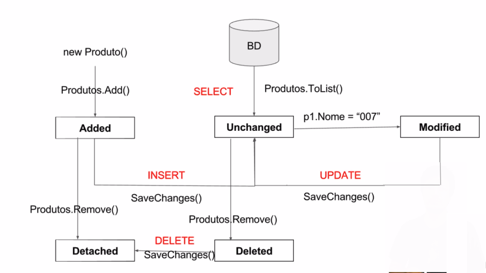

# Entity Framework

Itens necessários para podermos utilizar o Entity Framework Core em nossos projetos:

* Entity Framework Core através do gerenciador de pacotes Nugget;
* Informar no evento de configuração do contexto o nome do banco e sua localização;
* Criar as propriedades no contexto para dizer quais classes serão persistidas;
* Criar um contexto, em geral usando a nomenclatura ModeloDoNegocioContext por convenção, que vai herdar da classe DbContext.

### **CRUD com Entity**

SaveChanges() -> ss alterações só são feitas no banco depois que chamamos o método SaveChanges.

### **ChangeTracker**

Verifica se houve modificação ou não em um item do banco.
Como o ChangeTracker sabe que, quando uma propriedade foi alterada, ele deve fazer um UPDATE no banco?

O Entity guarda um snapshot dos valores dos objetos por padrão. Quando aquele objeto começa a ser monitorado pelo Entity, seja através de métodos que recuperam objetos do banco via SELECT (por exemplo ToList, First, Find, etc.), seja através do método Entry que cria uma entrada no ChangeTracker para o objeto passado como argumento do método.

### **States**

**Added**

O objeto é novo, foi adicionado ao contexto, e o método SaveChanges ainda não foi executado. Depois que as mudanças são salvas, o estado do objeto muda para Unchanged. Objetos no estado Added não têm seus valores rastreados em sua instância de EntityEntry.

**Deleted**

O objeto foi excluído do contexto. Depois que as mudanças foram salvas, seu estado muda para Detached.

**Detached**

O objeto existe, mas não está sendo monitorado. Uma entidade fica nesse estado imediatamente após ter sido criada e antes de ser adicionada ao contexto. Ela também fica nesse estado depois que foi removida do contexto através do método Detach ou se é carregada por um método com opção NoTracking. Não existem instâncias de EntityEntry associadas a objetos com esse estado.

**Modified**

Uma das propriedades escalares do objeto foi modificada e o método SaveChanges ainda não foi executado. Quando o monitoramento automático de mudanças está desligado, o estado é alterado para Modified apenas quando o método DetectChanges é chamado. Quando as mudanças são salvas, o estado do objeto muda para Unchanged.

**Unchanged**

O objeto não foi modificado desde que foi anexado ao contexto ou desde a última vez que o método SaveChanges foi chamado.

### Comandos do Entity Framework Core

**Add-Migration:** Adds a new migration.

**Drop-Database:** Drops the database.

**Remove-Migration:** Removes the last migration.

**Scaffold-DbContext:** Scaffolds a DbContext and entity types for a database.

**Script-Migration:** Generates a SQL script from migrations.

**Update-Database:** Updates the database to a specified migration.

### 1:N (um para muitos)

1) Neste relacionamento, cada elemento da entidade A pode ter um relacionamento com vários elementos da entidade B.

2) Cada um dos elementos da entidade B pode estar relacionado a apenas um elemento da entidade A.

3) Na tabela que representa o relacionamento para muitos (N), deverá haver uma coluna referente à chave primária da primeira tabela, para que seja estabelecido o relacionamento entre ambas as tabelas.

 ### N:N (muitos para muitos)

 Para relacionar muitos com muitos, é necessário fazer uma tabela intermediária.
 Quando criamos uma tabela de join com uma chave estrangeira para uma outra tabela, é gerado um trigger OnDeleteCascade, que amarra os filhos. Portanto, se excluído o pai, o filho automaticamente é excluído.

 
 