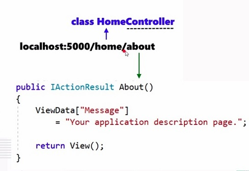

# ASP.NETCore

Ao criar um projeto ASP.NET Core, podemos escolher entre dois tipos de compilação: .NET Framework e .NET Core. Embora grande parte do código possa ser o mesmo em ambos os projetos, é preciso saber que existem vantagens e limitações em ambas as opções de compilação. 

### Crie aplicações ASP.NET Core para .NET Core nas seguintes situações:
* Você quer estender sua aplicação .NET Framework com uma nova área desenvolvida com ASP.NET Core +.NET Core.
* Você precisa desenvolver sua aplicação web em Windows, Linux ou MacOS.
* Você precisa executar sua aplicação web em Windows, Linux ou MacOS.
* Você precisa de microsserviços.
* Você precisa rodar sua aplicação web em contêineres Docker.
* Você precisa de aplicações web escaláveis e de grande performance.
* Você precisa de componentes .NET com versões "lado-a-lado".

### Ciclo de Vida
Quando falamos de injeção de dependência, temos que lembrar do ciclo de vida de objetos.

* **AddTransient:** serviços temporários/transitórios. A cada chamada ao método get service, é criado uma nova instância; 
* **AddScolped:** a cada requisição feita no browser, é gerado 1 instância do serviço dentro da mesma requisição;
* **AddSingleton:** cria uma instância única que vai existir durante toda a aplicação.

### MVC
Controllers => métodos que são chamados de actions. Para cada método, existe o retorno de uma View (componente que traz uma página html)
Ex: HomeController => é uma classe C# que herda de uma classe Controller. Ele contém métodos, e cada um dos métodos fornece uma View e tem o mesmo nome dos métodos.

Ele toma a partícula home e procura o controller equivalente, e isso é encontrado na classe HomeController, localizada na pasta "Controllers".

Além disso, ele precisa encontrar o método, para poder retornar a view. No caso, o método é o About(), que é chamado de ação, ou action. Ela é chamada a partir de um método do controller, ou seja, o próprio About(), que retornará um resultado IActionResult.

Models => contém as informações que serão injetadas para renderizar uma View no navegador

Views => é o que contém o código html e informações de como renderizar o html

### Resumindo...

