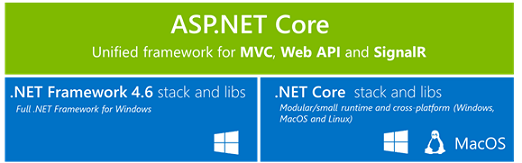
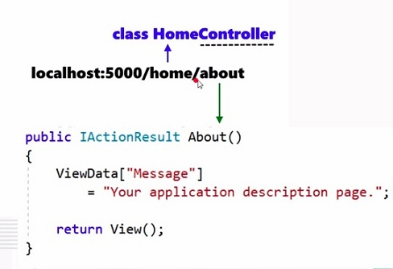
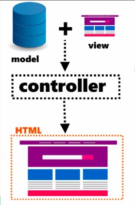
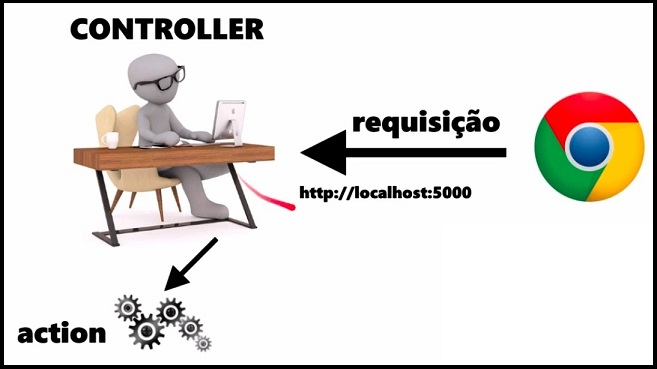
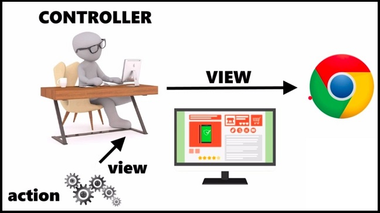
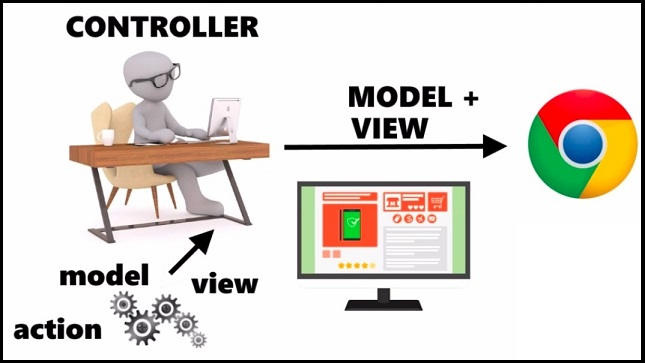

# ASP.NETCore

Ao criar um projeto ASP.NET Core, podemos escolher entre dois tipos de compilação: .NET Framework e .NET Core. Embora grande parte do código possa ser o mesmo em ambos os projetos, é preciso saber que existem vantagens e limitações em ambas as opções de compilação. 

### Crie aplicações ASP.NET Core para .NET Core nas seguintes situações:
* Você quer estender sua aplicação .NET Framework com uma nova área desenvolvida com ASP.NET Core +.NET Core.
* Você precisa desenvolver sua aplicação web em Windows, Linux ou MacOS.
* Você precisa executar sua aplicação web em Windows, Linux ou MacOS.
* Você precisa de microsserviços.
* Você precisa rodar sua aplicação web em contêineres Docker.
* Você precisa de aplicações web escaláveis e de grande performance.
* Você precisa de componentes .NET com versões "lado-a-lado".

### Ciclo de Vida
Quando falamos de injeção de dependência, temos que lembrar do ciclo de vida de objetos.

* **AddTransient:** serviços temporários/transitórios. A cada chamada ao método get service, é criado uma nova instância; 
* **AddScolped:** a cada requisição feita no browser, é gerado 1 instância do serviço dentro da mesma requisição;
* **AddSingleton:** cria uma instância única que vai existir durante toda a aplicação.

### MVC
Controllers => métodos que são chamados de actions. Para cada método, existe o retorno de uma View (componente que traz uma página html)
Ex: HomeController => é uma classe C# que herda de uma classe Controller. Ele contém métodos, e cada um dos métodos fornece uma View e tem o mesmo nome dos métodos.

Ele toma a partícula home e procura o controller equivalente, e isso é encontrado na classe HomeController, localizada na pasta "Controllers".

Além disso, ele precisa encontrar o método, para poder retornar a view. No caso, o método é o About(), que é chamado de ação, ou action. Ela é chamada a partir de um método do controller, ou seja, o próprio About(), que retornará um resultado IActionResult.

Models => contém as informações que serão injetadas para renderizar uma View no navegador

Views => é o que contém o código html e informações de como renderizar o html

**Como uma view obtém os dados do modelo para exibir na interface do usuário?**
Uma view automaticamente recebe o modelo a partir de uma action do controller. Em seguida, esse modelo é usado pelo mecanismo de renderização Razor para montar a interface.

### Resumindo...

### Injeção de Dependência

EX:

    public class PedidoController : Controller
    {
        private readonly IProdutoRepository produtoRepository;

        public PedidoController(IProdutoRepository produtoRepository)
        {
            this.produtoRepository = produtoRepository;
        }

Note que esse construtor está exigindo um parâmetro: 

        public PedidoController(IProdutoRepository produtoRepository) 
        
Esse parâmetro é uma dependência, isto é, sem ele o controller não vai funcionar, pois precisamos do repositório de produtos para podermos consultar os produtos do e-commerce.

Mas como esse parâmetro é injetado? Note que, em nenhum momento, nós instanciamos um controller diretamente, como por exemplo PedidoController meuController = new PedidoController(), certo?  O que fazemos na injeção de dependência é informar o ASP.NET Core sobre tudo o que a instância do controller precisa para ser criada. E então o que o ASP.NET Core faz automatimente, sem a gente ver?

* Ele cria uma instância de IProdutoRepository (através da classe ProdutoRepository)
* Ele cria uma instância de PedidoController, passando a instância de IProdutoRepository criada no passo 1.
* Ou seja, esse parâmetro é injetado automaticamente sempre que o ASP.NET Core cria uma nova instância do PedidoController.

### View Razor
Numa view Razor, qual a diferença entre @model (com inicial em minúscula) e @Model (com inicial em maiúscula)?

1. Para declarar com qual qual modelo a página Razor irá trabalhar, utilizamos a diretiva @model (inicial em minúscula). Nesse caso, Cadastro é a classe que serve de modelo para a view:

        @model Cadastro

2. Para acessar as propriedades do modelo, precisamos utilizar o objeto Model (inicial em maiúscula):

        <input type="text" class="form-control" id="nomeCliente" placeholder="Nome do Cliente"
       asp-for="@Model.Nome">

### Tag Helper
Uma AnchorTagHelper sempre tem pelo menos um atributo asp-...
Os atributos asp-... fazem o ASP.NET Core tratar a âncora como AnchorTagHelper, que será executada no servidor e em seguida irá gerar o código HTML final.

### Session
Para a aplicação não perder uma informação importante do usuário enquanto o usuário navega pelas páginas da aplicação.
O estado de sessão é um recurso do ASP.NET Core que você pode usar para salvar e armazenar dados de usuário enquanto o usuário navega seu aplicativo Web. Composto por um dicionário ou tabela de hash no servidor, o estado de sessão persiste dados entre solicitações de um navegador. É feito um back up dos dados da sessão em um cache.