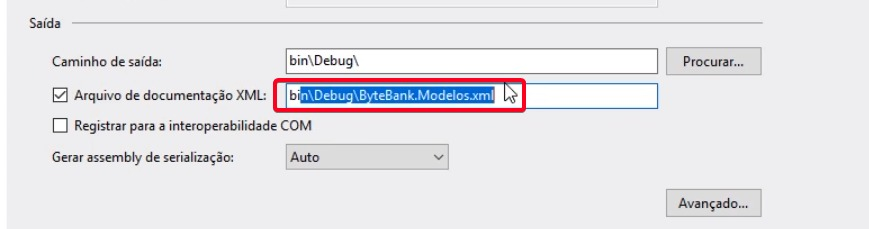

# Bibliotecas DLL

 A extensão .dll indica que se trata de uma biblioteca.

### Modificador Internal

 O modificador de acesso internal é uma classe validável apenas dentro da biblioteca. Assim, informamos para o compilador, de forma apropriada, que ela é interna.

    namespace ByteBank.Modelos
    {
        internal class ExemploHelper
        {
           ....
        }
    }

 Esse modificador de acesso, nos dá uma grande segurança e evita problemas futuros. Se em algum momento decidirmos mudar a implementação, correremos o risco de quebrar os projetos que dependem da classe ajudante Helper.

 Vale ressaltar que, quando não adicionamos um modificador de acesso na classe, o compilador assumirá automaticamente que ela é interna. Ou seja, podemos remover a palavra internal e o código continuará funcionando. Mas o compilador não vai aceitar se incluirmos ExemploHelper em Program, porque sem o modificador de acesso, a classe será interna.

### Modificador "internal protected"
 Permite que o método seja internal e seja utilizável nas classes derivadas. Isso nos lembra das situações em que usamos protected, por ficar visível para a classe que define e para a derivada. Mas não será fora da classe.

 Pode parecer que estamos misturando modificadores de acesso, porém, apesar de usarmos duas palavras separadas, internal protected é considerado um modificador de acesso único. Nós não podemos misturar private com public, ou public com protected. A única "combinação" existente é internal com protected.

### .dll

Uma biblioteca pode ser distribuída através do código compilado dll, forncecendo uma referência, que está no diretório bin, dentro da pasta Debug.

A versão que fica no diretório bin, dentro da pasta Debug é um .dll temporário, que sempre altera, conforme o VS recompila o código. Por isso, não podemos considerar esta versão instável para ser usada como referência. O que fazemos é mover a dll para um diretório no qual teremos versões estáveis de bibliotecas.

O VS só conhece .dll, com o qual definimos essa classe. Ele mostrará a partir dos metadados, sem mostrar efetivamente o código-fonte. 

### Duas formas de referenciar projetos: 

1. **projetos na mesma solução:** Para referenciar um projeto é necessário termos acesso ao código fonte da biblioteca. Devemos criar uma solução contendo o projeto de código e incluir a dependência de projeto.

2. **por DLL**: quando um executável é compilado, as bibliotecas usadas são copiadas para o mesmo diretório destino de compilação. Deste modo, a CLR poderá encontrar as definições dos tipos usados em sua aplicação, buscando as .DLLs no mesmo diretório do .EXE.

## Criando documentação

### Comentários
Existe um comentário especial no C# que é utilizado pelo compilador e pelo VS. Enquanto o comentário normal é introduzido por //(duas barras), este outro tipo de comentário terá /// (três barras).

      ///<sumary>
      ///Escrever instrução aqui
      ///</sumary>

E, ao incluirmos, o VS adicionará automaticamente o comentário `
`, que também foi colorido com cinza. Esta tag XML, traduzida para o português, significa resumo.

Desta forma, quando utilizamos a dll em outro projeto, essa instrução aparece ao deixarmos o cursor em cima da instância.

### Comentário para o construtor

      ///

      ///Escrever instrução aqui
      /// 

      ///<param name="param1"> instrução <see cref="propriedade1" /> </param>
      ///<param name="param2"> instrução <see cref="propriedade2" /> </param>

### Comentário para exceções

      /// 

      ///Instrução <see cref="propriedade"/>
      /// <exception cref="ArgumentException"> Descrever exceção </exception>
      /// 

      /// <param name="argumento"> e/ou <see cref="propriedade"/>. </param>

### Disponibilizando a documentação
Para que a documentação fique visível para outras soluções, temos que disponibilizar o xml.

1. No "Gerenciador de Soluções", clicar com o botão direito do mouse e selecionar a opção "Propriedades". 
2. No painel que será aberto, clicar em "Build", encontrando diversas opções. 
3. Na seção "Saída/Output", marcar o check box "Arquivo de documentação XML", o Visual Studio vai autocompletar um caminho padrão para o arquivo da documentação bin\Debug\ByteBank.Modelos.xml.

4. Recompilar a aplicação (Rebuild).
5. O VS deve gerar uma documentação no diretório bin > Debug e encontraremos um arquivo novo: BibliotecaExemplo.xml.
6. Copiar o arquivo XML no diretório em que está a dll.

### Lidando com datas

Temos um tipo especial de representar uma data no .NET: DateTime. Existem 12 construtores diferentes de datetime.

> DateTime.Now 

É um membro estático da classe DateTime, que tem a data no momento em que código é executado. 

Se quisermos representar um _intervalo de tempo_, podemos usar TimeSpan.

### NuGet

É o gerenciador de pacotes do VS, que pode ser usado para aplicações .NET. Lá encontramos várias bibliotecas que podem ser aproveitados pelo editor. Utilizando o NuGet, não é necessário termos a dll em nossa máquina. 

Ao adicionarmos um pacote do NuGet, estamos adicionando no arquivo packages.config do nosso projeto a _dependência do pacote_.