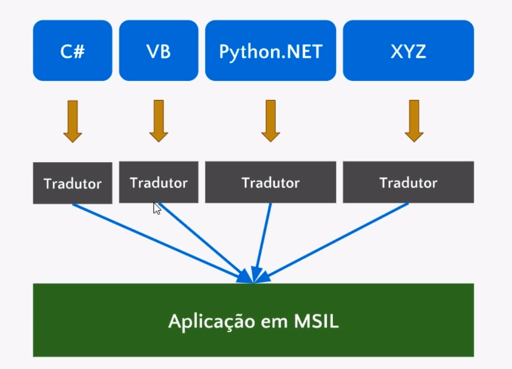
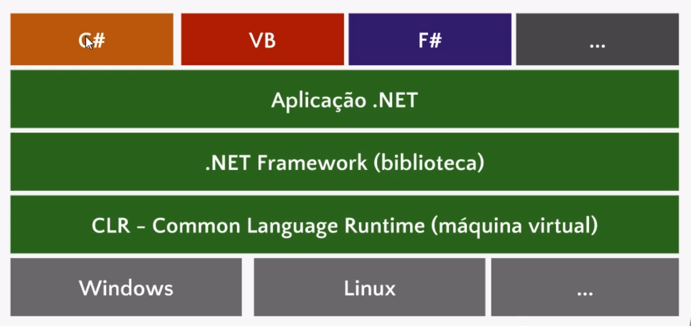

# CSharp
Anotações - Curso CSharp Alura

## Histórico e Ecossistema C#

Antigamente, sempre que se criava uma aplicação em uma determinada linguagem, era preciso trabalhar com uma biblioteca correspondente.

A Microsoft tinha um ecossistema de aplicações gigantesco no fim dos anos 80, que ia além do Windows ou o pacote Office. Eram vários times de desenvolvimento dentro da Microsoft, adotando linguagens diferentes. 

Se por algum motivo fosse necessário reescrever a aplicação inicialmente escrita em C e passá-la para VB era necessário reescrever também a biblioteca. O desenvolvedor que criou a aplicação em C teria que aprender VB e como é o funcionamento de suas bibliotecas. Isto diminuia a produtividade e criava outros problemas, ainda mais quando decidíamos mudar o sistema operacional. Teríamos que reescrever a aplicação, a biblioteca, para cada sistema operacional (Linux, Android, Mac OS). 

### Plataforma e Biblioteca
Na plataforma, em vez de desenvolvermos uma aplicação e uma biblioteca para cada sistema operacional, é construída a aplicação para uma máquina virtual, uma máquina emulada, simulada dentro de um computador real. Destinamos para ela a nossa aplicação.

Desta forma, temos um implementação para o Windows, o Linux, mas escrevemos o código para a máquina virtual. É criado uma linguagem chamada de **MSIL - Microsoft Intermediate Language**, que será usada pela biblioteca e pela a aplicação. A aplicação MSIL não é gerada por nós programadores.

Vamos escrever o código em C#, em VB, Pyhton.NET ou qualquer outra que escolhermos.Vamos lançar o código que nós escrevemos para um _tradutor_, que irá transformá-lo, em código MSIL. Será irrelevante se escrevemos em C# ou VB, porque teremos uma aplicação MSIL no fim. Mas vamos adotar outro termo, em vez de tradutor, utilizaremos a palavra **compilador**, que transformará uma determinada linguagem em outra.

Agora podemos trabalhar com linguagens como C#, VB, F#, que poderão ser compiladas para a aplicação escrita em MSIL. 

Se decidirmos introduzir um novo sistema operacional, não precisamos mais fazer alterações na biblioteca ou na aplicação. Criaremos uma máquina virtual para o sistema operacional e a aplicação continuará a mesma. 

Resumindo:

Toda linguagem .NET será compilada para o formato MSIL, que vai ser executada pela CLR. A máquina virtual, somente em momento de execução do aplicativo, vai converter para o código de máquina.
